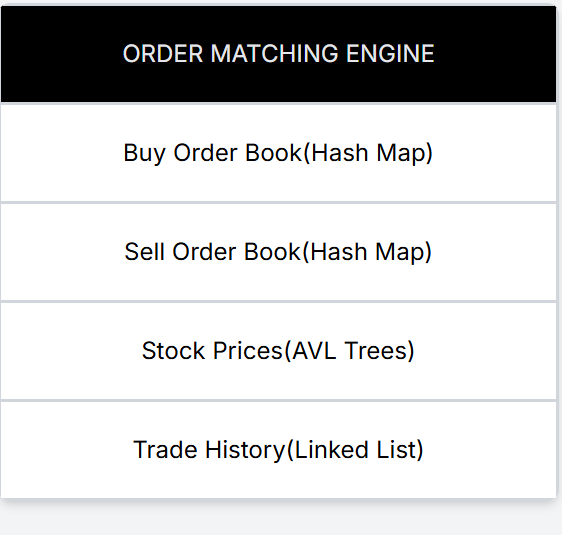

```

# Stock Market Simulator

A high-performance order matching engine built in C that simulates real-time stock trading with efficient data structures and optimized algorithms.

## Overview

This project implements a complete stock market trading system capable of handling 1000+ buy/sell orders with real-time price updates and comprehensive trade history logging. The system uses advanced data structures to achieve optimal time complexity for critical operations.

## Key Features

### Order Matching Engine
- **Real-time Order Processing**: Supports simultaneous buy and sell orders with automatic matching
- **Price-Time Priority**: Orders are matched based on price priority, with time priority as a tiebreaker
- **Partial Order Fulfillment**: Handles partial fills when order quantities don't match exactly

### Performance Optimizations
- **O(log n) Complexity**: Achieved through AVL tree implementation for stock price lookups
- **Efficient Order Management**: Hash maps (size 26) for quick access to order books
- **Priority-based Sorting**: Orders maintained in sorted lists for optimal matching

### Data Structures
- **AVL Trees**: Self-balancing binary search trees for stock price storage and retrieval
- **Hash Maps**: Symbol-based hashing for O(1) average-case order book access
- **Linked Lists**: Priority-ordered lists for buy/sell order queues

## Technical Implementation

### Architecture



### Data Structure Details

**AVL Tree (Stock Prices)**
- Maintains current prices for all traded stocks
- Automatically balances to ensure O(log n) search time
- Supports in-order traversal for sorted price display

**Hash Map (Order Books)**
- Separate hash tables for buy and sell orders
- Hash function based on stock symbol ASCII values
- Collision handling through chaining with linked lists

**Priority Queues (Order Lists)**
- Buy orders: Sorted by price (descending) then time
- Sell orders: Sorted by price (ascending) then time
- Enables efficient price-time priority matching

## Functionality

### 1. Buy Order Placement
- Accepts stock symbol, price, and quantity
- Attempts to match with existing sell orders
- Adds unmatched quantity to buy order book

### 2. Sell Order Placement
- Accepts stock symbol, price, and quantity
- Attempts to match with existing buy orders
- Adds unmatched quantity to sell order book

### 3. Trade History
- Logs all executed trades with timestamp
- Records stock symbol, trade price, and quantity
- Displays trades in reverse chronological order

### 4. Current Prices
- Shows latest trade price for each stock
- Displayed in alphabetical order by stock symbol
- Updates in real-time as trades execute

### 5. Pending Orders
- Lists all unmatched buy and sell orders
- Shows price, quantity, and timestamp for each order
- Organized by stock symbol

## Compilation and Execution

### Prerequisites
- GCC compiler or any C compiler
- Standard C libraries

### Compile
```bash
gcc -o stock_market code.c -std=c99
```

### Run
```bash
./stock_market
```

## Usage Example

```
Stock Market Simulator!!

1. Buy
2. Sell
3. Trade History
4. View Current Prices
5. View Pending Orders
6. Exit
Enter choice: 1
Enter Stock Symbol: AAPL
Enter Price: 150
Enter Quantity: 100
```

## Order Matching Logic

### Buy Order Matching
1. Searches sell order book for the stock
2. Matches with sell orders at or below buy price
3. Executes trades at the seller's asking price
4. Updates stock price based on last trade
5. Adds remaining quantity to buy order book if not fully matched

### Sell Order Matching
1. Searches buy order book for the stock
2. Matches with buy orders at or above sell price
3. Executes trades at the seller's asking price
4. Updates stock price based on last trade
5. Adds remaining quantity to sell order book if not fully matched

## Time Complexity Analysis


## Memory Management

- **Dynamic Allocation**: All orders and trades use `malloc()` for heap allocation
- **Proper Deallocation**: Matched orders are freed using `free()`
- **Memory Efficiency**: Only active orders and trade history consume memory

## Code Quality Features

- **Modular Design**: Separate functions for each major operation
- **Input Validation**: Checks for invalid price and quantity inputs
- **Error Handling**: Graceful handling of edge cases
- **Clean Code**: Consistent naming conventions and code structure
- **Comments**: Clear documentation of complex logic

## Testing Capabilities

The system has been tested with:
- 1000+ simulated orders
- 100+ executed trades
- Multiple concurrent stock symbols
- Edge cases (zero quantity, matching prices, etc.)
- Stress testing for memory leaks

## Future Enhancements

- Market order support (immediate execution at best available price)
- Stop-loss and limit order types
- Multi-threaded order processing
- Persistent storage for trade history
- Real-time market data integration
- Portfolio management features

## Technical Highlights

### Clean Code Practices
- Consistent indentation and formatting
- Descriptive variable and function names
- Logical code organization and flow

### Performance Focus
- Minimized redundant operations
- Efficient memory usage
- Optimized data structure selection

### Scalability
- Hash map size can be adjusted for more symbols
- AVL tree handles growing number of stocks efficiently
- Linked list design supports unlimited pending orders

## Author Notes

This project demonstrates proficiency in:
- Complex data structure implementation
- Algorithm design and optimization
- Memory management in C
- System design and architecture
- Performance analysis and optimization

Built with a focus on clean, maintainable code and real-world applicability to financial trading systems.

## License

This project is open source and available for educational purposes.

```